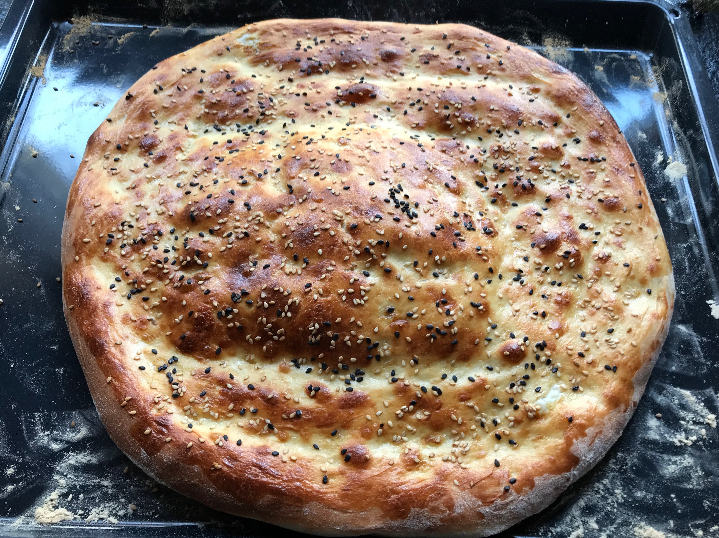

# Backwaren
## Fladenbrot
### 1 Stück
(reicht für 4 Döner, erwachsener Mensch isst zwei Döner)

### Zutaten
- 300g Mehl
- 30ml Öl
- 1 EL Zucker
- 1 Tl Salz
- 180ml Wasser
- 7g Trockenhefe
- 1 Ei
- (Sesam, Schwarzkümmel, Salzflocken)

### Zubereitung
1. Alle Zutaten und die Hälfte vom Ei vermischen
2. 10 Minuten kneten bis der Teig glatt ist
3. 45 Minuten abgedeckt ruhen lassen
4. Vorsichtig in Form drücken, 10 Minuten ruhen lassen (Luft muss drin bleiben)
5. Mit Ei bestreichen, eindrücken, mit Sesam bestreuen
6. Im vorgeheizten Backofen mit einer Tasse Wasser auf dem Boden bei maximaler Temperatur ca. 10-15 Minuten backen

### Anmerkungen
- 125g Fleisch und 30g Soße pro Döner
